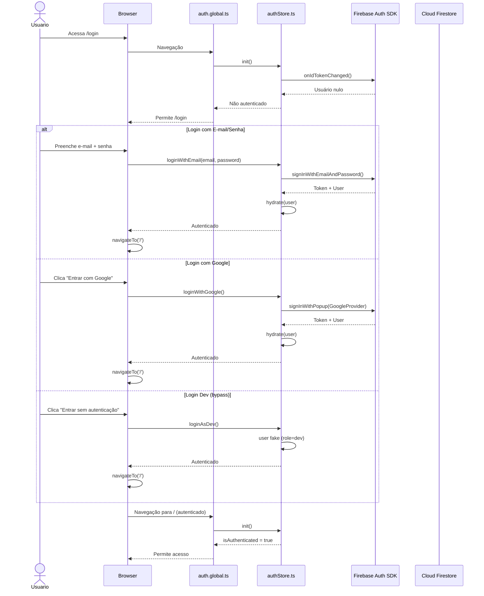
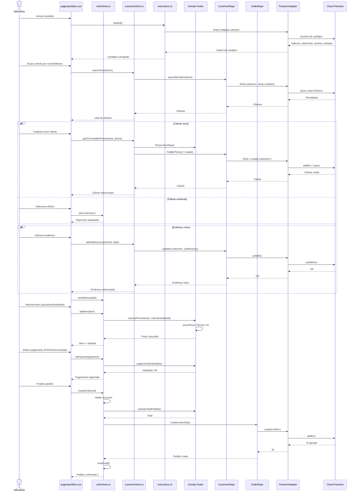
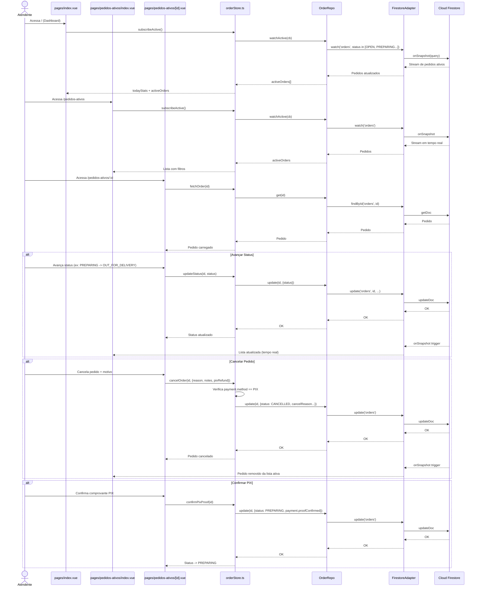
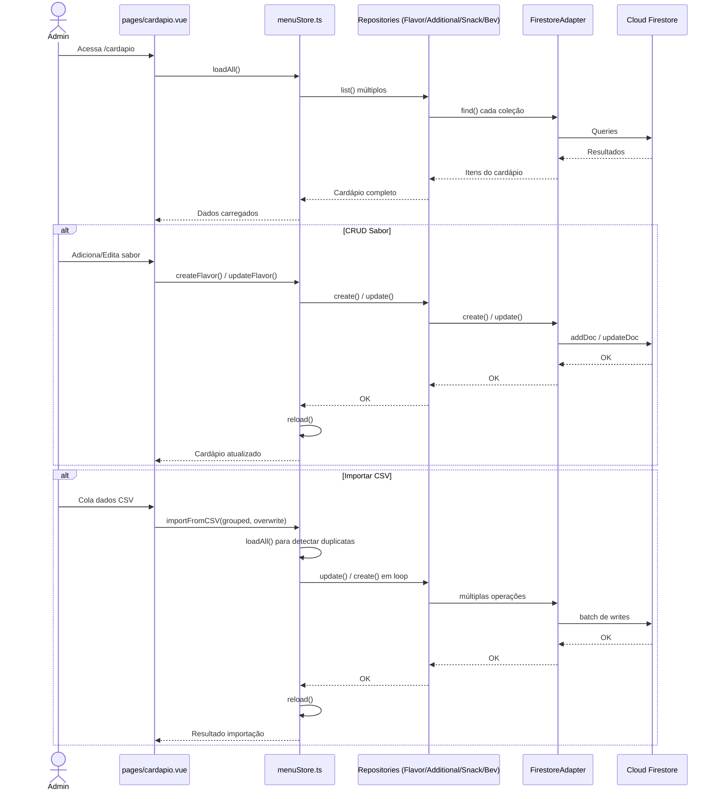
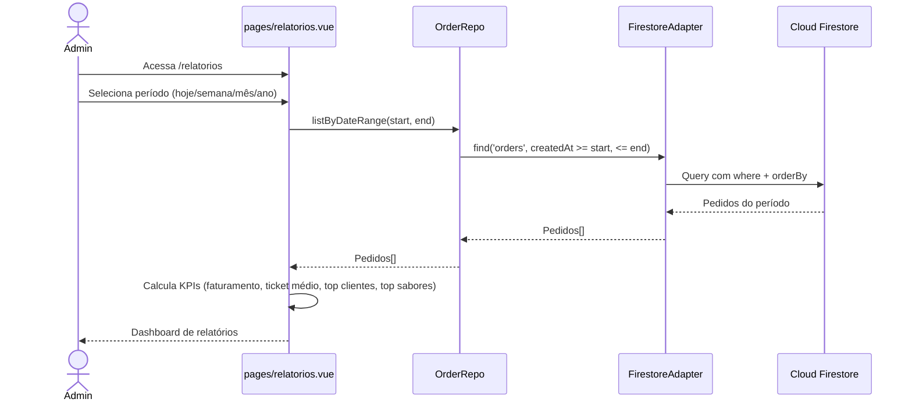
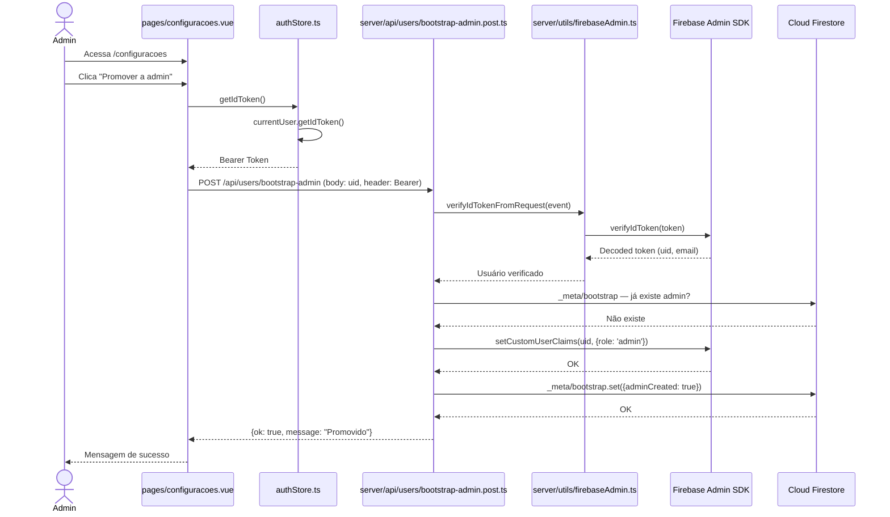

# Diagrama de Sequência — Pizzaria Renata

## 1. Autenticação (Login)

## 2. Criar Pedido (PDV Completo)

## 3. Acompanhamento de Pedidos em Tempo Real

## 4. Gerenciamento de Cardápio

## 5. Relatórios

## 6. Bootstrap de Administrador (Server-side)

